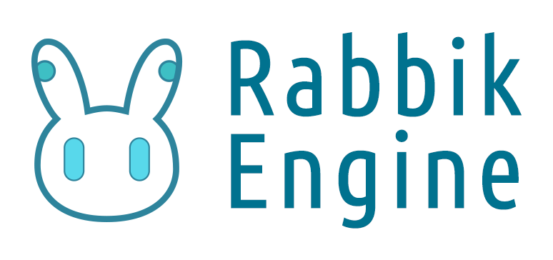

# Rabbik Engine

## Info
This is a working personal project. The purpose is to learn, and build a useable, cross-platform 2D game engine.
Currently not accepting any pull requests.

Icons, characters and other artworks of Rabbik Engine are works of mine. Do not steal.

## Coding convention
* **Pointers** are only used when the client *doesn't control the life time* of the object, where pointers of `ManualObject` are the exception.
* `Object` provides functions of *Reflection*. Pure data classes does not inherit `Object`.
* Inherit `ManualObject` or `ReferencedObject` instead of `Object` to indicate the method of controlling the memory life time. `ReferencedObject` are used with `ReferencePtr`, which is essentially a *intrusive pointer*.

## Used libraries
* Make system: [CMake](https://cmake.org)
* Unit testing: [DocTest](https://github.com/onqtam/doctest)
* String formating: [fmt](https://github.com/fmtlib/fmt)
* ~~Math: [glm](https://github.com/g-truc/glm)~~
* Compressing data: [zlib](https://github.com/madler/zlib)
* PNG image procressing: [libpng](https://github.com/glennrp/libpng)
* C# scripting embedding: [mono](mono-project.com)
* Linux Window: [GTK](https://www.gtk.org/)

## Referenced materials
* [.NET Source](https://source.dot.net)
* [Godot Engine](https://godotengine.org/)
* [Game Programming Patterns](https://gameprogrammingpatterns.com/)([zh-cn](https://gpp.tkchu.me/))
* [Learn OpenGL](https://learnopengl.com/)([zh-cn](https://learnopengl-cn.github.io/))
* [The Cherno Game Engine Series](https://www.youtube.com/playlist?list=PLlrATfBNZ98dC-V-N3m0Go4deliWHPFwT)
* [Don't Store That in a Float](https://randomascii.wordpress.com/2012/02/13/dont-store-that-in-a-float/)
* [Discussion about Update and FixedUpdate](https://news.ycombinator.com/item?id=23649406)
* [Frame Pacing Analysis of the Game Loop](https://nkga.github.io/post/frame-pacing-analysis-of-the-game-loop/)
